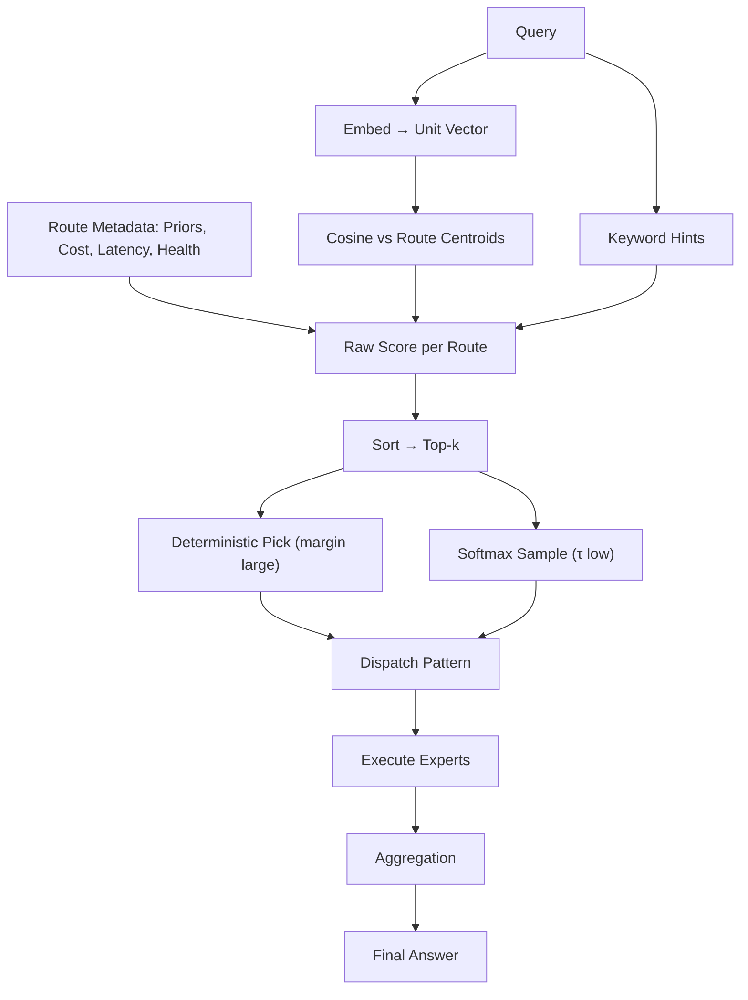

# Article 1 — Routing Fundamentals
*Build the routes, embeddings, centroids, raw scoring; pick temperature and top-k; dispatch & aggregation patterns.*

---

## TL;DR
- Treat routing as a lightweight, interpretable ranking problem: compute a **raw score** per route from simple, additive signals (semantic similarity to a route centroid, keyword hints, priors, cost/latency, health), then pick **top-k**.
- Use **static centroids** per route (mean of normalized example embeddings) and keep them stable; update only when evaluation proves drift.
- Keep **temperature** low (τ≈0.25–0.40) and only sample when scores are close; otherwise take the argmax.
- Start with **single-winner** dispatch; add **cascade** fallback and **parallel K-of-N** for critical flows. Aggregate with **RRF** or **semantic agreement**.
- Log every hop. Make promotion to production boring: defaults, guardrails, rollback.

---

## What a “route” is
A **route** is a named decision path that sends a request to one or more experts (tools, prompts, models, functions, retrievers). Routes are stable. What varies per request is which route wins and how many experts it fans out to.

Each route has:
- **Purpose** — what it solves.
- **Examples** — short, real queries (positive/negative).
- **Centroid** — mean embedding of positive examples.
- **Signals** — keyword hints, priors, cost/latency, availability.
- **Dispatch recipe** — single, cascade, or K-of-N parallel.
- **Aggregation recipe** — how multiple outputs are fused.

---

## Embeddings & centroids

### Embedding setup
Use a compact text-embedding model and L2-normalize vectors (cosine ready).

```python
import numpy as np

def l2norm(x):
    n = np.linalg.norm(x)
    return x / (n + 1e-12)
```

### Centroid construction
For each route collect 10–100 positive examples, embed, normalize, then **centroid = mean → normalize**.  
Use **`tools/build_centroids.py`** to write centroids into `routes.yaml` from `examples/routes_examples.yaml`.

---

## Raw scoring (additive & transparent)

\[
\text{score}_r(q) =
w_{sim}\cdot \cos(\mathbf{e}_q, \mathbf{c}_r)
+ w_{kw}\cdot kw_r(q)
+ w_{prior}\cdot \pi_r
- w_{cost}\cdot cost_r
- w_{lat}\cdot latency_r
+ w_{health}\cdot health_r
+ bias_r
\]

Keep weights tiny and sparse; the similarity term does the heavy lifting. Defaults live in `config.yaml → router.weights`.

---

## Temperature & top-k
Compute scores for all routes, sort, take **top-k**. If the **margin** between rank-1 and rank-2 exceeds a threshold (default 0.06), pick the winner deterministically. Otherwise you may **softmax-sample** over top-k with τ≈0.25–0.40.

---

## Dispatch & Aggregation
- **Dispatch**: single-winner, cascade fallback, or parallel K-of-N (`dispatch.py`)
- **Aggregation**: take-first, **RRF**, or **semantic agreement** (`aggregate.py`)

---

## Guardrails & Telemetry
- Health/budget/latency gates and allow/deny lists at route level.
- Structured JSONL logs of component scores & decisions (`telemetry.py`).

---

## Mermaid overview


---

## Quickstart

```bash
python -m venv .venv && source .venv/bin/activate  # Windows: .venv\Scripts\activate
pip install -r requirements.txt
# optional vLLM server:
# pip install vllm
# vllm serve Qwen/Qwen2.5-7B-Instruct --port 8000 --dtype bfloat16
```

Build centroids from seed examples:
```bash
python tools/build_centroids.py --config config.yaml --examples examples/routes_examples.yaml --routes routes.yaml
```

Use **playground_qwen_router.ipynb** to tweak temperature/top‑k or **cli.py** to rank/pick/chat.
